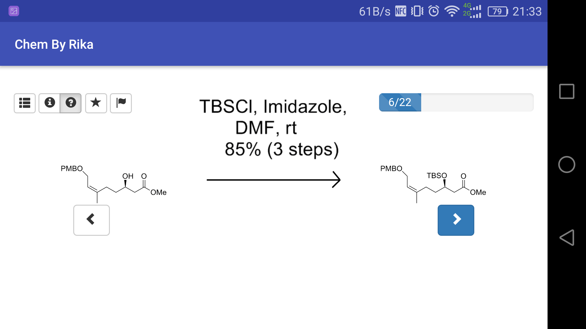

# ChemByRika
An elevated third-party client or web app for Chemistry By Design

# 简要说明
这是一个可以用来代替Chemistry By Design的**离线**第三方客户端/网页应用。

[Android 应用下载](https://github.com/RikaSugisawa/ChemByRika/releases)

目前仅提供英文支持，内部合成路线定期发布更新。

iOS系统暂无支持，可自行打包或上传至自己的服务器

# Details

## Dependencies(aleady packed)
* [jquery](https://github.com/jquery/jquery)
* [Bootstrap](https://github.com/twbs/bootstrap)
* [Zoom](http://www.jqueryscript.net/zoom/Easy-jQuery-Image-Inner-Zoom-Plugin-evenZoom.html)
* [smart-time-ago](https://github.com/pragmaticly/smart-time-ago)

## Screenshots(Android)

## Android Client
This is packed with Webview, compiled with Android Studio.

## Multi-device support
Only ready for big screen (screen.height>432px) and small screen (screen.height<=432px)

## Release
[Android Application](https://github.com/RikaSugisawa/ChemByRika/releases)

## Lisence
* You may download releases and source code.
* You may modify or recompile source code, however must NOT remove copyright info.
* Any re-upload of executable file or source code of original project or modified version is FORBIDDEN.
